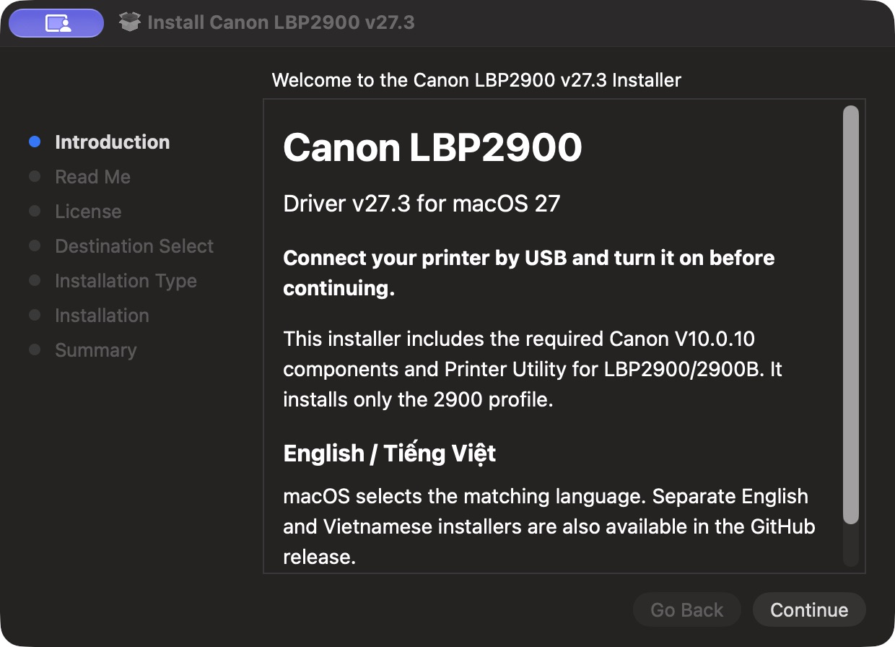

# Canon LBP2900 for macOS 27 — v27.3

**English** · [Tiếng Việt](README.vi.md)

A community driver for **Canon LBP2900 / LBP2900B over USB**, with Canon Printer Utility, macOS Print Center integration, and native Canon print options. Built from the verified Canon Printer Driver & Utilities for Mac V10.0.10, with an isolated runtime that registers only the 2900 profile.

**Experimental.** Hardware testing used an LBP2900, Apple Silicon and macOS **27.2**. `v27.3` is this project's release version. LBP2900B and Intel builds are included as targets but have not been qualified on their respective hardware.

## Download

| Installer | Language |
|---|---|
| [Canon-LBP2900-v27.3.pkg](https://github.com/bechou0410/canon-lbp2900-macos27-driver/releases/download/v27.3/Canon-LBP2900-v27.3.pkg) | Automatic macOS language selection; English fallback |
| [Canon-LBP2900-v27.3-en.pkg](https://github.com/bechou0410/canon-lbp2900-macos27-driver/releases/download/v27.3/Canon-LBP2900-v27.3-en.pkg) | English |
| [Canon-LBP2900-v27.3-vi.pkg](https://github.com/bechou0410/canon-lbp2900-macos27-driver/releases/download/v27.3/Canon-LBP2900-v27.3-vi.pkg) | Tiếng Việt |

[Release notes and SHA-256 checksums](https://github.com/bechou0410/canon-lbp2900-macos27-driver/releases/tag/v27.3). All language variants install the same driver payload. Canon's native Utility and print dialogs remain in English; the installer introduction, instructions and conclusion are localized. macOS supplies Installer's navigation buttons. Use the separate language packages for an explicit choice; the native welcome page has no custom language tabs.



## Install

1. Finish or cancel all Canon jobs. If an earlier project driver is installed, [remove it first](#remove-or-reinstall).
2. Connect **one powered-on LBP2900 by USB** and open the PKG. Review Canon's included license and authenticate on your Mac.
3. v27.3 checks the connected printer and creates **Canon LBP2900** with the required native transport when the queue name is available. It starts the printer status service for the signed-in desktop. Existing queues and the default printer are preserved.
4. Open **System Settings → Printers & Scanners → Canon LBP2900 → Options & Supplies → Utility → Open Printer Utility**. The Utility should show **Ready to Print**.

If the printer was disconnected, connect it and run:

```sh
sudo '/Library/Application Support/CanonLBP2900Standalone/lbp2900-standalone' configure-connected
```

If `Canon_LBP2900` already exists, automatic setup preserves it for review. Finish its jobs and remove only that printer queue before retrying the command. Multiple attached devices also require manual selection. Adding a direct USB queue through macOS alone does not establish the native status connection; use the setup command above.


Utility image from the verified 0.2.4 installation; v27.3 changes its displayed product name while preserving native machine code.

The PKG has no Developer ID Installer signature or Apple notarization. Changed components are signed ad-hoc. Testing did not disable SIP or Gatekeeper. For maintenance and recovery details, see [setup and architecture](docs/standalone-capt.md).

## What has been fixed and verified

| Feature / fix | Evidence and limits |
|---|---|
| USB printing on Apple Silicon / macOS 27.2 | Six user-confirmed sheets across the native-driver development sequence: four with patch-only 0.1.0, two before/after the official Canon reinstall with 0.2.1/0.2.2. v27.3 retains their native processing behavior. |
| Printer Utility status and job controls | Ready, out of paper, top cover open, USB loss/reconnect, Pause, Resume and Cancel observed on the real printer. |
| macOS Print Center | Queue pause/resume/remove and opening the private Utility verified. After handoff to Canon's service, use Canon Utility for the physical job. |
| Native Canon print options | Restored the missing CAPTUIKit framework; Finishing, Paper Source, Quality/Toner and About dialogs loaded through Preview from the private runtime. Physical output of every option is not qualified. |
| Extra original Utility opening and crashing | Separated the native error-notification channel; two real notifications opened only one private Utility while both driver services ran, with no new original-app crash. |
| USB monitor surviving queue removal | Lifecycle checks identify the loaded executable even when its process name is short; guarded removal waits for owned processes. |
| Utility crash after a manual USB queue | Reproduced on 0.2.4 and corrected by establishing the native transport/service. v27.3 adds connected-printer setup after installation; conflicting queues are preserved for review. |
| Later official Canon V10.0.10 installation | Private hashes, queue, Utility and an actual print survived an official reinstall on 0.2.2. Other Canon model hardware was unavailable. |
| Reproducible packaging and languages | Automated render, signature, dependency, ownership, lifecycle, isolation and bilingual-resource checks. See [verification scope](docs/verification.md). |

**Still unqualified:** LBP2900B hardware, Intel hardware, other Macs/macOS 27 point releases, reboot/login recovery, Cleaning, every physical media/quality option, other Canon printer operation and long-running reliability. LBP2900 has no color printing or automatic duplex hardware. This release does not claim those capabilities.

## Remove or reinstall

Finish/cancel all jobs in Canon Printer Utility, then remove this driver's queue in Printers & Scanners. Earlier versions may name it `Canon_LBP2900_Standalone`; v27.3 uses `Canon_LBP2900`. Then run:

```sh
sudo '/Library/Application Support/CanonLBP2900Standalone/lbp2900-standalone' remove
```

The helper verifies ownership and installed file hashes before removing the private runtime, backend, PPD, service and receipt. Original Canon drivers and unrelated printers are preserved. User preferences/cache are retained. Existing private installations are deliberately refused by the installer; remove them before reinstalling.

## Build from source

On macOS with Python 3.11+ and Apple's command-line tools:

```sh
python3 tools/capt-standalone.py --language all
python3 tests/standalone-test.py
```

The builder downloads the pinned official input over HTTPS, validates its checksum, Canon installer signature and notarization, then selects, relocates, signs and packages the required components. Outputs and checksums are under `artifacts/`, which is excluded from Git. Tests render real documents offline and never register a printer or print a page.

The private runtime, backend, ports, process names and notification channel keep the 2900 driver separate from the original Canon installation. Internal support paths retain their earlier names for compatibility. [Technical details](docs/standalone-capt.md) · [Historical patch-only route](docs/native-capt-setup.md)

## Credits and notices

Canon owns the original driver, utilities and resources. This project is independent and is not endorsed or certified by Canon or Apple. The original Canon license is included in the installer. See [NOTICE.md](NOTICE.md) and the [official Canon source](https://vn.canon/en/support/0101321320). Historical releases based on `rastertocapt` are superseded by this native-driver route.
