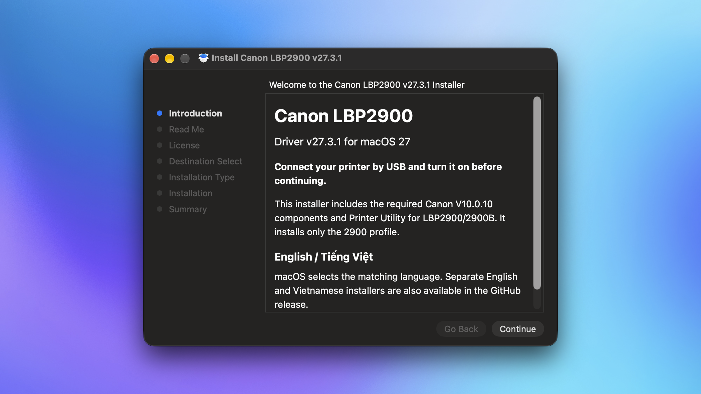
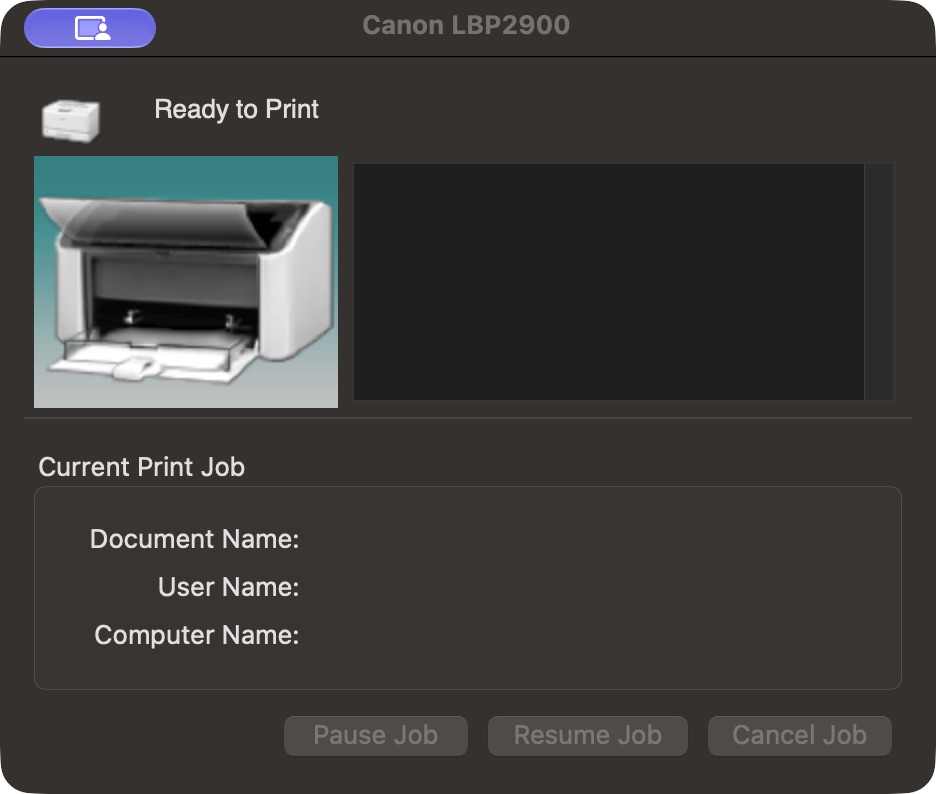
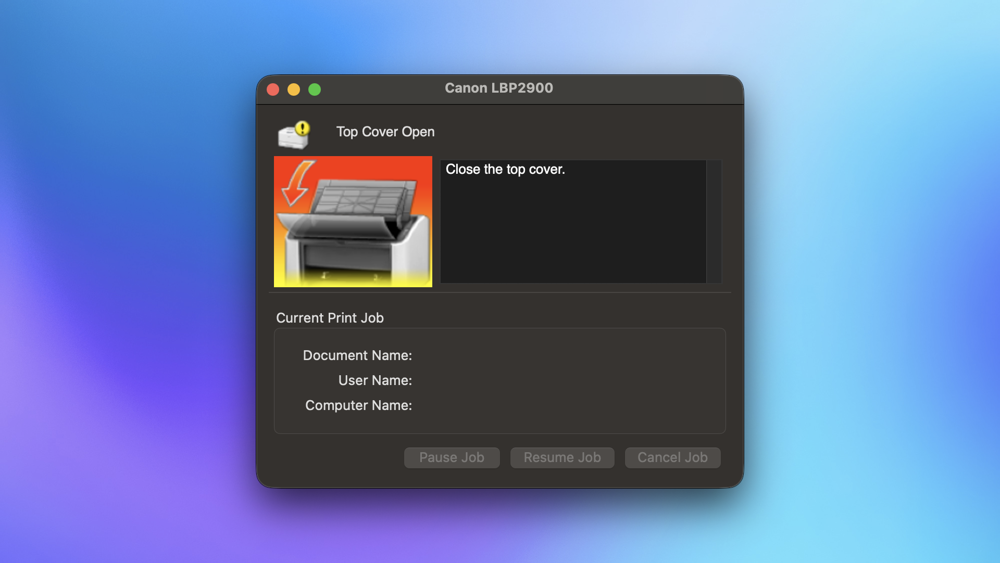
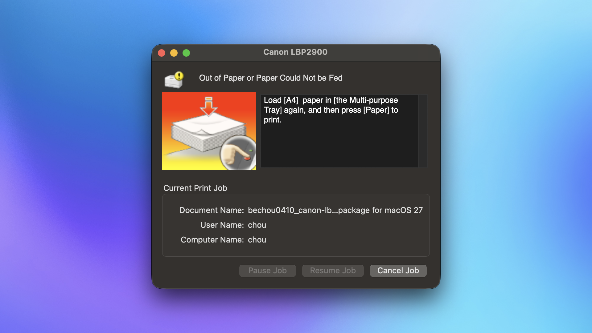

# Canon LBP2900 for macOS 27

**English** · [Tiếng Việt](README.vi.md)

A complete USB driver package for **Canon LBP2900 / LBP2900B**, including Canon Printer Utility, macOS Print Center integration and native Canon print options. Install it directly—no separate Canon driver installation is required.

**[Download Canon LBP2900 v27.3.3](https://github.com/bechou0410/canon-lbp2900-macos27-driver/releases/download/v27.3.3/Canon-LBP2900-v27.3.3.pkg)** · [Release notes and checksum](https://github.com/bechou0410/canon-lbp2900-macos27-driver/releases/tag/v27.3.3)

One installer contains English and Vietnamese content and follows macOS language preferences, with English as fallback. Canon Utility and native print dialogs remain in English.

## Driver in action

<table>
<tr><th width="25%">Installer</th><th width="25%">Ready to Print</th><th width="25%">Top Cover Open</th><th width="25%">Out of Paper</th></tr>
<tr><td><a href="docs/images/installer-preview.png"></a></td><td><a href="docs/images/utility-ready.png"></a></td><td><a href="docs/images/utility-cover-open.png"></a></td><td><a href="docs/images/utility-out-of-paper.png"></a></td></tr>
</table>

Screenshots supplied by the user from the installed driver: the installer, Ready to Print, top-cover detection and an out-of-paper alert. Click an image to view it at full size. The installer screenshot shows v27.3.1; v27.3.3 adds a fix for the background service crashing when cancelling an errored job.

## Features and verification

| Feature | Status |
|---|---|
| USB printing | Verified on LBP2900, Apple Silicon and macOS 27.2; six user-confirmed sheets during driver validation. |
| Printer status | Ready, out of paper, cover open and USB disconnect/reconnect verified. |
| Job controls | Pause/Resume verified. v27.3.3 fixes a newly reproduced Cancel crash after a paper error; automated regression passes and the user confirmed a successful empty-tray retest on LBP2900/macOS 27.2. |
| macOS Print Center | Queue controls and opening Printer Utility verified. |
| Canon print options | Finishing, Paper Source, Quality/Toner and About dialogs load correctly. |
| Dedicated driver runtime | Separate from the original Canon driver; an official Canon reinstall preserved the private driver and a real print. |
| Reinstall / upgrade | Live upgrade to v27.3.3 preserved both printer PPDs and the default-printer state. Same-version reinstall and historical upgrades also pass automated payload tests. |

**Test scope:** LBP2900 / Apple Silicon / macOS 27.2. The package is experimental; LBP2900B and Intel hardware, other Macs/macOS versions, reboot/login recovery, Cleaning, every physical media/quality option and endurance still need qualification. The release number is the driver version. See [verification evidence](docs/verification.md).

## Install

1. Finish or cancel all jobs in Canon Printer Utility.
2. Connect one powered-on LBP2900 by USB and open the PKG. You can install over an intact project driver without uninstalling it.
3. Follow Installer and authenticate on your Mac. On a fresh setup, the package creates **Canon LBP2900** with its native connection and status service. Existing project queues, options and the default printer are preserved on reinstall.
4. Open **System Settings → Printers & Scanners → Canon LBP2900 → Options & Supplies → Utility → Open Printer Utility**. Check for **Ready to Print**.

**If macOS says “Apple could not verify…”:** the package is not Developer ID signed or notarized. For a download you have checked against the release checksum, follow Apple's [Open Anyway instructions](https://support.apple.com/en-au/102445) in **System Settings → Privacy & Security**. This is a per-package exception; the project does not require disabling SIP or Gatekeeper.

If the printer was disconnected during installation, connect it and run:

```sh
sudo '/Library/Application Support/CanonLBP2900Standalone/lbp2900-standalone' configure-connected
```

A pre-existing queue created manually in macOS is preserved for review; adding a direct USB queue alone does not establish the native status connection. Finish its jobs and remove only that conflicting Canon queue before retrying setup. Multiple attached printers require manual selection. See [setup and recovery](docs/standalone-capt.md).

## Reinstall or remove

To reinstall or upgrade, open the new PKG directly after finishing all Canon jobs. Modified or unrecognized files are refused. If installation is interrupted, rerun the PKG; recovery proceeds only when installed integrity passes.

To uninstall, finish/cancel all Canon jobs and remove this driver's queue in Printers & Scanners, then run:

```sh
sudo '/Library/Application Support/CanonLBP2900Standalone/lbp2900-standalone' remove
```

The helper removes the project-owned runtime and receipt. Original Canon drivers, unrelated printers and user preferences remain.

## Build

On macOS with Python 3.11+ and Apple's command-line tools:

```sh
python3 tools/capt-standalone.py
python3 tests/standalone-test.py
```

The builder verifies the official Canon input, packages the required components and writes one bilingual PKG plus its SHA-256 file under `artifacts/`. Tests use real payloads and render documents without printing. [Build and architecture details](docs/standalone-capt.md).

## Credits

Developed with assistance from **OpenAI Codex** for implementation, debugging, automated testing and documentation, with hardware testing and print validation performed by the project maintainer.

Based on Canon Printer Driver & Utilities for Mac V10.0.10. Canon owns the original code and resources; the original license is included. This community project is independent and is not endorsed or certified by Canon or Apple. [Notices](NOTICE.md) · [Official Canon source](https://vn.canon/en/support/0101321320) · [Previous releases](https://github.com/bechou0410/canon-lbp2900-macos27-driver/releases).
