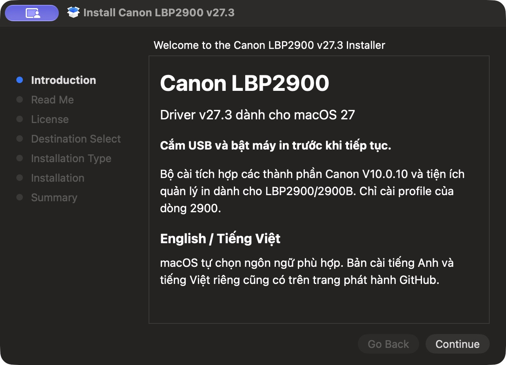

# Canon LBP2900 cho macOS 27 — v27.3

[English](README.md) · **Tiếng Việt**

Driver cộng đồng cho **Canon LBP2900 / LBP2900B qua USB**, giữ Canon Printer Utility, tích hợp Print Center của macOS và các tùy chọn in Canon gốc. Được build từ Canon Printer Driver & Utilities for Mac V10.0.10 đã xác minh, dùng runtime riêng và chỉ đăng ký profile dòng 2900.

**Bản thử nghiệm.** Máy thử thực tế là LBP2900, Apple Silicon, macOS **27.2**. `v27.3` là phiên bản phát hành của project. LBP2900B và Intel là mục tiêu hỗ trợ nhưng chưa được nghiệm thu trên phần cứng tương ứng.

## Tải bộ cài

| Bộ cài | Ngôn ngữ |
|---|---|
| [Canon-LBP2900-v27.3.pkg](https://github.com/bechou0410/canon-lbp2900-macos27-driver/releases/download/v27.3/Canon-LBP2900-v27.3.pkg) | Tự chọn theo ngôn ngữ macOS; mặc định dự phòng tiếng Anh |
| [Canon-LBP2900-v27.3-en.pkg](https://github.com/bechou0410/canon-lbp2900-macos27-driver/releases/download/v27.3/Canon-LBP2900-v27.3-en.pkg) | Tiếng Anh |
| [Canon-LBP2900-v27.3-vi.pkg](https://github.com/bechou0410/canon-lbp2900-macos27-driver/releases/download/v27.3/Canon-LBP2900-v27.3-vi.pkg) | Tiếng Việt |

[Ghi chú phát hành và checksum SHA-256](https://github.com/bechou0410/canon-lbp2900-macos27-driver/releases/tag/v27.3). Các bản ngôn ngữ có cùng payload driver. Tiện ích và hộp thoại Canon gốc vẫn dùng tiếng Anh; phần giới thiệu, hướng dẫn và hoàn tất bộ cài có bản dịch. Nút điều hướng của Installer do macOS cung cấp. Có thể chọn gói ngôn ngữ riêng; trang giới thiệu gốc của Installer không có hai tab ngôn ngữ tùy chỉnh.



## Cài đặt

1. Hoàn tất hoặc hủy mọi job Canon. Nếu đã có bản driver của project, [gỡ bản trước](#gỡ-hoặc-cài-lại).
2. Cắm USB và bật **đúng một LBP2900**, mở PKG, đọc license Canon đi kèm và xác thực trực tiếp trên Mac.
3. v27.3 kiểm tra máy đang kết nối, tạo **Canon LBP2900** với kết nối đúng khi tên queue chưa được sử dụng, rồi khởi động dịch vụ trạng thái cho phiên desktop đang đăng nhập. Queue cũ và máy in mặc định được giữ nguyên.
4. Mở **System Settings → Printers & Scanners → Canon LBP2900 → Options & Supplies → Utility → Open Printer Utility**. Tiện ích cần hiện **Ready to Print**.

Nếu lúc cài máy in chưa kết nối, cắm USB rồi chạy:

```sh
sudo '/Library/Application Support/CanonLBP2900Standalone/lbp2900-standalone' configure-connected
```

Nếu đã có `Canon_LBP2900`, bộ cài giữ queue đó để kiểm tra. Hoàn tất job, xóa riêng queue đó rồi chạy lại lệnh. Có nhiều thiết bị kết nối cũng cần chọn thủ công. Chỉ thêm queue USB trực tiếp trong macOS sẽ chưa thiết lập kết nối trạng thái gốc; dùng lệnh thiết lập ở trên.


Ảnh Utility v27.3 sau khi cài trên máy thử; mã máy gốc giữ nguyên từ 0.2.4.

PKG chưa có chữ ký Developer ID Installer hoặc notarization của Apple. Thành phần đã sửa được ký ad-hoc. Quá trình thử không tắt SIP hoặc Gatekeeper. Xem [thiết lập và kiến trúc](docs/standalone-capt.md) để bảo trì và khôi phục.

## Các tính năng đã sửa và kiểm tra

| Tính năng / lỗi đã sửa | Bằng chứng và giới hạn |
|---|---|
| In USB trên Apple Silicon / macOS 27.2 | Người dùng xác nhận sáu tờ trong quá trình phát triển: bốn tờ với patch-only 0.1.0, hai tờ trước/sau cài lại Canon gốc với 0.2.1/0.2.2. v27.3 giữ hành vi xử lý in gốc đã kiểm. |
| Trạng thái và điều khiển job trong Utility | Đã kiểm thực tế Ready, hết giấy, mở nắp, rút/cắm USB, Pause, Resume và Cancel. |
| Print Center | Đã kiểm tạm dừng/tiếp tục/xóa job trong queue và mở Utility riêng. Khi job được bàn giao cho dịch vụ Canon, dùng Canon Utility để điều khiển job vật lý. |
| Tùy chọn Canon gốc | Bổ sung CAPTUIKit còn thiếu; Finishing, Paper Source, Quality/Toner và About nạp từ runtime riêng qua Preview. Chưa nghiệm thu đầu ra vật lý của mọi tùy chọn. |
| Tự mở thêm Utility Canon gốc rồi crash | Tách kênh thông báo lỗi; hai lần thông báo thật chỉ mở một Utility riêng khi hai dịch vụ cùng chạy, không có crash mới từ ứng dụng gốc. |
| Monitor USB còn chạy sau khi xóa queue | Nhận diện bằng file thực thi đang nạp dù tên tiến trình ngắn; helper chờ tiến trình riêng dừng trước khi gỡ. |
| Utility crash sau khi thêm queue USB thủ công | Tái hiện ở 0.2.4; thiết lập đúng kết nối/dịch vụ gốc giải quyết lỗi. v27.3 thêm thiết lập máy đang kết nối sau khi cài, giữ queue trùng tên để kiểm tra. Luồng tự thiết lập đã qua phép thử cài v27.3 trên máy Mac thử nghiệm. |
| Cài Canon V10.0.10 gốc sau driver này | Hash riêng, queue, Utility và một lượt in thật vẫn hoạt động sau cài lại Canon gốc trên 0.2.2. Chưa có máy Canon model khác để thử phần cứng. |
| Build có thể kiểm chứng và ngôn ngữ | Kiểm tự động dựng trang, chữ ký, dependency, ownership, vòng đời, cách ly và tài nguyên hai ngôn ngữ. Xem [phạm vi kiểm tra](docs/verification.md). |

**Còn cần nghiệm thu:** phần cứng LBP2900B/Intel, các máy Mac và bản macOS 27 khác, phục hồi sau reboot/đăng nhập, Cleaning, mọi tùy chọn giấy/chất lượng trên bản in, in trên máy Canon khác và độ ổn định dài hạn. LBP2900 không có phần cứng in màu hoặc duplex tự động; bản này không công bố các tính năng đó.

## Gỡ hoặc cài lại

Hoàn tất/hủy mọi job trong Canon Printer Utility rồi xóa queue của driver trong Printers & Scanners. Bản trước có thể dùng tên `Canon_LBP2900_Standalone`; v27.3 dùng `Canon_LBP2900`. Sau đó chạy:

```sh
sudo '/Library/Application Support/CanonLBP2900Standalone/lbp2900-standalone' remove
```

Helper kiểm ownership và checksum trước khi gỡ runtime, backend, PPD, dịch vụ và receipt riêng. Driver Canon gốc và máy in khác được giữ nguyên. Preference/cache theo người dùng được giữ lại. Installer từ chối runtime riêng đã có; cần gỡ trước khi cài lại.

## Build từ source

Trên macOS có Python 3.11+ và công cụ dòng lệnh Apple:

```sh
python3 tools/capt-standalone.py --language all
python3 tests/standalone-test.py
```

Builder tải đầu vào Canon đã khóa checksum qua HTTPS, kiểm chữ ký Canon/notarization rồi chọn thành phần, đổi namespace, ký và đóng gói. Kết quả và checksum ở `artifacts/`, bị loại khỏi Git. Test dựng tài liệu thật offline, không đăng ký máy in hoặc in giấy.

Runtime, backend, cổng, tên tiến trình và kênh thông báo riêng giúp driver 2900 cùng tồn tại với bản Canon gốc. Đường dẫn hỗ trợ nội bộ giữ tên trước để tương thích. [Chi tiết kỹ thuật](docs/standalone-capt.md) · [Hướng patch-only lịch sử](docs/native-capt-setup.md)

## Ghi nhận và bản quyền

Canon sở hữu driver, tiện ích và tài nguyên gốc. Project độc lập, không được Canon hoặc Apple chứng nhận. Bộ cài giữ license Canon gốc. Xem [NOTICE.md](NOTICE.md) và [nguồn Canon chính thức](https://vn.canon/en/support/0101321320). Các bản phát hành `rastertocapt` cũ được thay bằng hướng driver gốc hiện tại.
